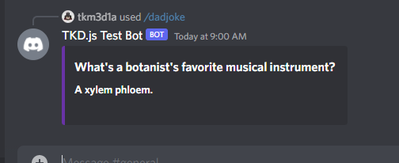

# tt-discord-bot

This will be a first attempt at a discord bot for personal/fun use.  It is meant to be a good practice of JS and working with various api's for different functions.  I will also be deploying it on my own services to get practice completing that sort of task as well.

## Features: 
###### *in work/TBD*
- ~~Tell dad jokes on command~~
  - ~~API: [Dad Jokes](https://dadjokes.io)~~
  - ~~Subscribed through: [RapidAPI](https://www.rapidapi.com)~~
- Tell cat facts on demand
  - This won't be an API but rather an internal function and file with some random facts I can find
- Have a help menu
- Announce when new people enter the chat
  - Possibly pull a random fact to include when this happens?
- play the "repeat" game
  - turned off only by a command
- info menu?


## Progress tracking

- 10/25/22
  - Finished up dadjoke slash command
  - Returns an embedd like so:
    - 
  - Improvments for future:
    - Add a delay so setup and punchline are different
    - Maybe use a button to require interaction to see punchline?
    - Add category requesting
      - Requires paid api, might need to investigate other api otpions
  - Next Steps:
    - Work on "cat facts" command
    - May or may not be built with db to pull from?
      - db is used loosely, might just be a json or simple csv

- 10/24/22
  - https://aws.random.cat/meow
  - https://api.urbandictionary.com/v0/define?term=hello%20world
  - Successfully got the cat image fetch to work with undici
  - Still having issues trying to use node-fetch
    - Seems to have some incompatiability
    - receiving ```function not found``` and ```properties undefined``` errors when trying different methods
    - Have tried both v3.x and v2.x per various stackoverflow searches
    - Need to continue trouble shooting later
  - Added rapidAPI key for dad jokes to dotenv and setup to call/hide correctly
  - **Evening fixes:**
    - Fixed node fetch
    - Got embed working
    - Calling dadjoke api successfully
    - Now to clean up and figure best way to present joke in chat
    - Possibly add counter to avoid using api call to often

- 10/23/22
  - Added info for adding rest api calls in resources section
  - nothing added to code
  - Allows starting on API calls for dad jokes as next step

- 10/11/22
  - Fixed bug for reading js variables
    - the fix was changing the string to use backticks(`) instead of single quotes(')
  - Moved commands to their own seperate files
  - Made event folder structure as well
  - Tested working, saw new console log statment on interactionCreate's
  - left old code in index.js for tracking, will remove eventually
  - next step is to work on custom interactions?
  - Left off:
    - [discord.js interactions](https://discordjs.guide/interactions/slash-commands.htm)
    
- 10/10/22
  - Successfully registered three commands to bot
  - built out replies to those commands using if/else blocks
  - encountered bug with giving js variables in strings
    - marked both with TODO's in files.  Still need to investigate mroe
  - tested in server, working correctly
  - Next step is to move commands to seperate files
    - left off: [discord.js commands guide](https://discordjs.guide/creating-your-bot/command-handling.html#individual-command-files)

- 10/8/22
  - Have bot token information transfered over from previous tests
  - setup discord.js and rest fo folder structure
  - Successfully tested and saw successfull login
  - still using dotenv
  - no commands registered yet
  - following tutorial from here: [discord.js guide](https://discordjs.guide/creating-your-bot/)
    - Left off on "Creating commands" step

## Addtional Resources

Info on Builders in discord.js
- [Builders](https://discordjs.guide/popular-topics/builders.html)

Discord.js Docs
- [Discord.js Docs](https://discord.js.org/#/docs/discord.js/main/general/welcome)

REST API info
- [undici guide](https://discordjs.guide/additional-info/rest-api.html#making-http-requests-with-node)
    
---
Made By: Tim Tinkers

Ver 0.0 *unreleased*

